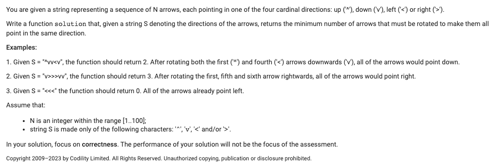
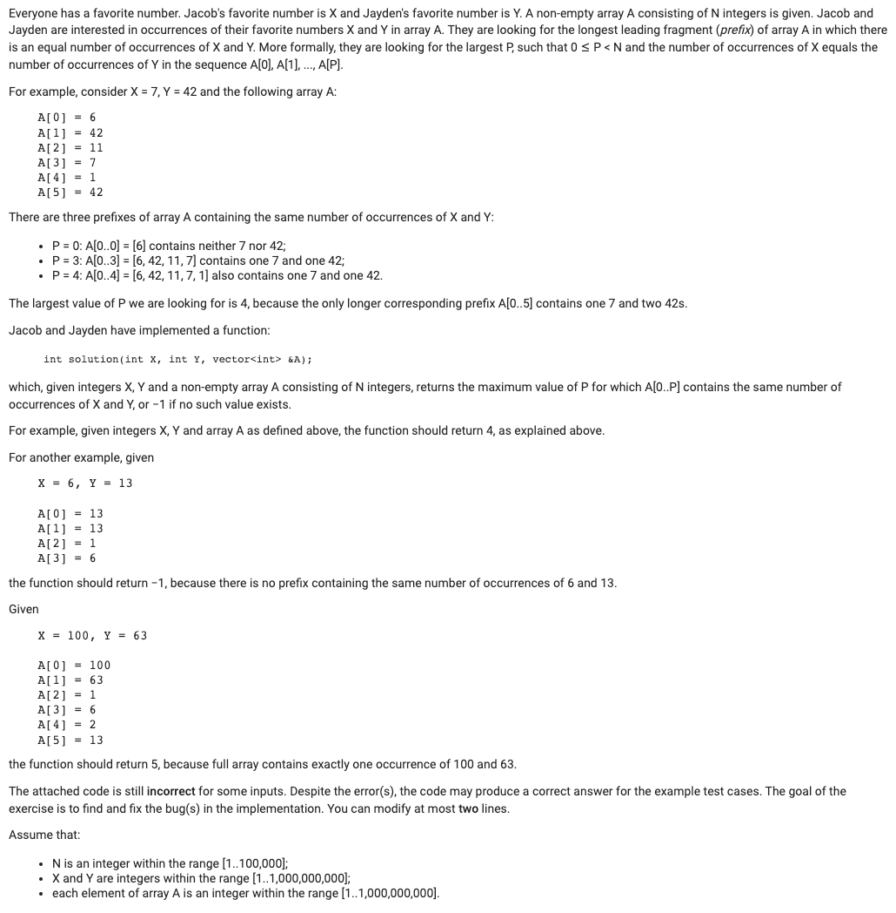
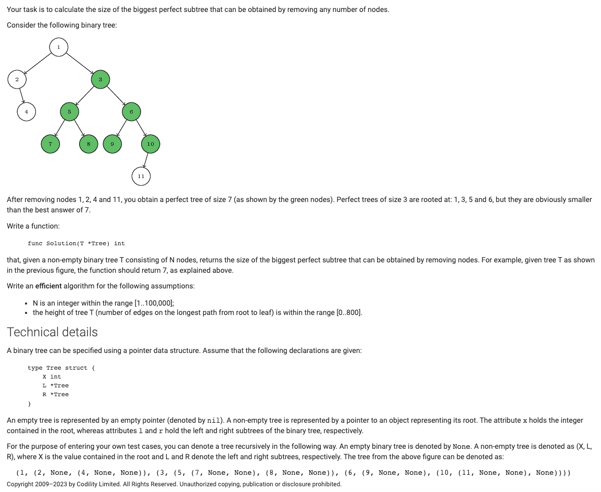
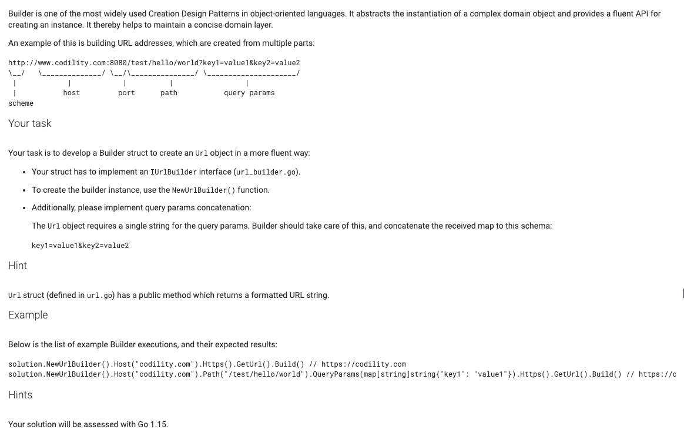
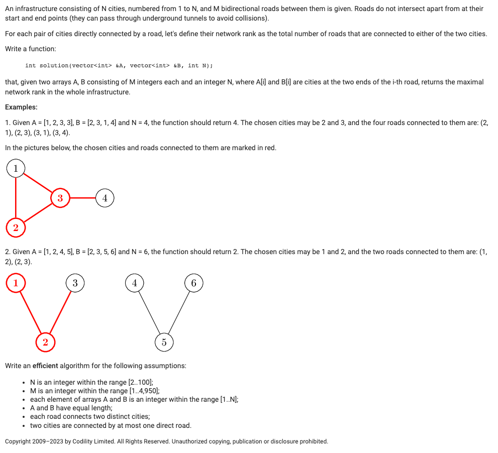

### Q1

签到题

### Q2

此题需要在已有代码基础上作修改，easy

### Q3

签到题，统计最高的"满二叉"子树的节点数之和

满二叉树的节点数计算公式：2^h-1（树高h从1开始）；

为什么是min(a, b)*2 + 1 ？

a、b其实表示左右子树高度，前h层共有2^h-1个节点（记为a），第h+1层有2^h个节点，那么层高为h+1的满二叉树共有：2^(h+1)-1 = all = 2^h + 2^h-1 = 2*(2^h-1)+1 = 2*a+1

### Q4

非算法题，工程题：建造者模式，构建URL对象

### Q5

企业银行部的题（前4道与全球职能部一模一样，多了这个第5题）

Easy：相当于两个相连的节点视为为一组，计算这一组的度（相当于依次将两个相邻节点视为一个节点，然后找出度最大的那一个），注意返回值要加上这两个节点自身的边（实现的话就是减去1，看代码）